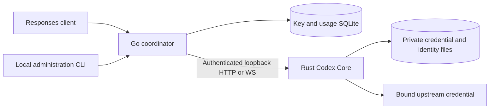

# Architecture

[Setup](../README.md) · [Behavior](BEHAVIOR.md) · [Protocol](../src/protocol/v1/README.md)

## Runtime ownership

Go authenticates distribution Keys, binds each to one credential, supervises Core and records usage.
Rust owns provider credentials/refresh, transport clients, Subscription normalization and identity/context
state. The CLI is the administration surface; the public API exposes only Responses HTTP/SSE and WS.
Core receives an opaque Key-derived scope, never the raw downstream Key. Internal startup authentication
arrives through stdin; readiness uses one bounded stdout record. See the protocol for exact fields.

## Credential and transport boundaries

API-key bodies and valid WS frames pass through; Subscription callers receive the pinned Codex
normalization and scoped identity mapping. Caller markers cannot switch those profiles. Transport
pools and TLS state are credential-isolated. HTTP remains HTTP and WS remains WS through recovery.

Subscription HTTP expands valid references using complete local history. Subscription WS defers its
provider handshake until the first create supplies identity, then may use a validated live reference
or complete reconstruction. API-key WS establishes the provider connection before the public upgrade.
Only proven-unsent inference permits bounded recovery; uncertain sends are not silently replayed.

## Separate state lifetimes

| State | Owner and purpose | Lifetime |
|---|---|---|
| Credentials | Rust vault; OAuth/API secrets and fingerprint mode | Private persistent files; explicit lifecycle operations |
| Key and usage | Go SQLite; routing, revocation, status, latency, tokens | Usage details default to seven days; daily aggregates survive |
| Identity graph | Rust account namespace with isolated Key scopes; typed reversible aliases and lineage | Persistent, bounded; inactive details become pruning-eligible after 30 days |
| Full context and comparison data | Rust memory; exact HTTP reconstruction and prefix association | Three business-idle hours, earlier capacity eviction; active operations protected |
| Live WS facts | Socket/session ownership, required mappings, turn token and delivery state | Independent bounded lifetime while the connection/context remains usable |
| Response ID cache | Bounded pairs for allowlisted flat text/reasoning deltas | Lazy operation-owned memory; cleared on identity/operation changes |

Bulk-history expiry does not prove upstream WS state is gone. Three capabilities stay distinct:

- Full reconstruction needs materialized local context.
- Automatic full-to-delta sending needs a matching actual socket/configuration/input/output baseline.
- An explicit WS delta needs valid scoped mappings and supported projection; upstream still decides
  whether its referenced context is available. Completion of that delta cannot recreate missing old bodies.

## Context indexing and admission

Normalize structured comparison items without changing caller payloads. Hashes locate candidates;
exact comparison verifies equality. Intern immutable items/history blocks and use compressed prefix
indexing to avoid retaining a full duplicate per response. Validate explicit IDs, ownership and tool
dependencies before selecting a completed-response prefix; recency cannot resolve conflicting owners.
Equivalent content may be shared, while execution lanes and consumed tool calls remain separate.

Reserve required context/assembly and output-tracking capacity before inference. Count shared
allocations once; account encoded JSON through a checked writer over borrowed values. Accounting
budgets are not RSS limits. Keep completion facts separately bounded so cache pressure may prevent
history retention without turning otherwise valid delivery into partial reusable history.

## Publication and failure

Persist typed aliases before exposing newly projected IDs. Publish complete context/ownership before
public completion; reconcile item events and the final footer once. Unfinished/conflicting output cannot
form a success baseline. Compaction commits only after matching terminal and required item proof.
The [behavior guide](BEHAVIOR.md#completion-and-recovery) defines exact failure-tail and replacement rules.

Ordinary flat deltas can resolve every typed ID carrier from a bounded cache under the existing
account file lock. Cache identity includes namespace, credential owner, Key scope and response owner;
file device/inode, length, nanosecond modification/change times and day must also match. Hits retain
per-event lifecycle validation and context observation. Unknown/nested carriers, misses, file/day
changes and terminal/compaction events use the full transaction. Seed only after a successful stable
read; writes must be re-read before reuse. No full ledger or event body is cached. Unchanged private
reads preserve file timestamps, and unchanged full transactions skip serialization. Non-Unix targets
fall back to full transactions. [Memory guidance](MEMORY.md#response-identity-work) gives bounds/tests.

Network reads, semantic progress and total request time are different boundaries. The provider HTTP
client has a 15-second connect timeout and a 300-second read timeout; neither establishes a total
inference deadline. Core additionally bounds SSE event idle and terminal tails for streaming/JSON;
Go bounds HTTP body reads and client writes with request-scoped cancellation and joined watchdogs.
See [timeout semantics](BEHAVIOR.md#completion-and-recovery). Usage TTFB measures response headers,
not first semantic output. Diagnose prolonged operations using usage/proxy evidence without retaining
bodies; see [memory guidance](MEMORY.md).

Persistent identity files contain only bounded schema-owned relationships; body text, ciphertext,
credentials and arbitrary resource IDs are not recursively rewritten or copied into usage records.
Client tools, Skills, workspaces and code-mode execution remain client-owned.
